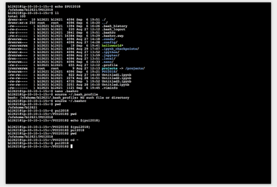
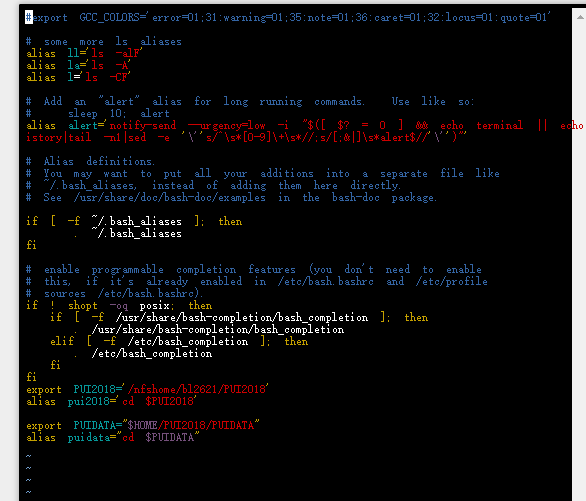

# PUI 2018 HW 1

**On NYU classes please turn in your github account name where the repositories you will create in this and the following homework sets will be hosted.**

## Reading:

[What is the question? Jeff Leek & Roger D. Peng](https://www.d.umn.edu/~kgilbert/ened5560-1/The%20Research%20Question-2015-Leek-1314-5.pdf)

## Assignment 1: Set up your environment:

# describe what I did to set up my environment:

nano .bashrc
export PUI2018="/nfshome/bl2621/PUI2018"
alias pui2018="cd $PUI2018"

source ~/.bashrc
pwd
pui2018
pwd




follow the instructions in [HW1_2_instructions.md](https://github.com/fedhere/PUI2018_fb55/blob/master/HW1_fb55/HW1_2_instructions.md)

GRADING: 

We will grade you based on blackboard submittion of your screenshots

## Assignment 2:  Reproducible research.

**EXTRA CREDIT**

This may be hard, but figuring it out will greatly help you get the most out of the next several lectures. We keep track of your EC assignments and they will help your final grade. This homework is a notebook: this is the standard format of the homeworks in the future. To get full points your notebook must

- be rendered (e.g. plots must be visible) so that we see what you intended to turn in

- run: the TA must be able to download your notebook and run it without error. 

Create a notebook of your own following the steps outlined in [this notebook](https://github.com/fedhere/PUI2018_fb55/blob/master/HW1_fb55/HW1_3_instructions.ipynb)

To get the scheleton notebook you can clone my repository, fork my repository, or do it manually as follows:

1) On the terminal (bash shell) go to the PUI2018_<NYUid> directory you created in Assignment 2 and set up as a repo in the lab/Assignment 1.

2) Download the notebook I created (link above). There are several ways ot do this, including  **click on Raw** next to the notebook. 
Now you have 2 choices: you can copy and paste the RAW ipython notebook (which is  a JSON file) onto a new file on your own machine (name the file HW1_reproducible_distributions.ipynb) or you can use the wget command on the terminal: typing 
```
wget https://raw.githubusercontent.com/fedhere/PUI2018_fb55/master/HW1_fb55/HW1_3_instructions.ipynb
```
will save a version of the notebook in the directory where you were when you typed the command. **wget**, which stands for web get, downloads any files, or even entire directories, from a web URL.

3) Fill in the code cells that I left empty following the directions.

4) Once the notebook is done and rendered submit it through NYUclasses


## References:

markdown syntax - http://daringfireball.net/projects/markdown/syntax

basic bash commands - http://www.tldp.org/LDP/abs/html/basic.html

environment setup - http://tldp.org/LDP/Bash-Beginners-Guide/html/sect_03_01.html#sect_03_01_02

additional references were provided in the class slides.

**Text Editors.**

-m

remember to add the -m “my commit message” when you commit to github, otherwise github will automatically open a text editor for you to type your message in , and then you have to deal with it. If github opened a text editor it is either emacs or vi, depending on your setup. If you are using emacs or vi, either because github opened them or to edit files, this is how you save your work and exit:


*emacs* 

Save: Ctrl+x Ctrl+s

Exit: Ctrl+x Ctrl+c

(if your emacs is running on the terminal you have to use these shortcuts, if it is running in its own X window you can use the dropdown menu)


*vi*

Save: esc :w

Exit: esc :q


## Key Concepts:

falsifiability and law of parsimony

types of scientific questions

reproducible research

basic bash commands

understanding what is an environment (and a docker, virtual envuronment, virtual machine etc)
understand how to setup your environment


