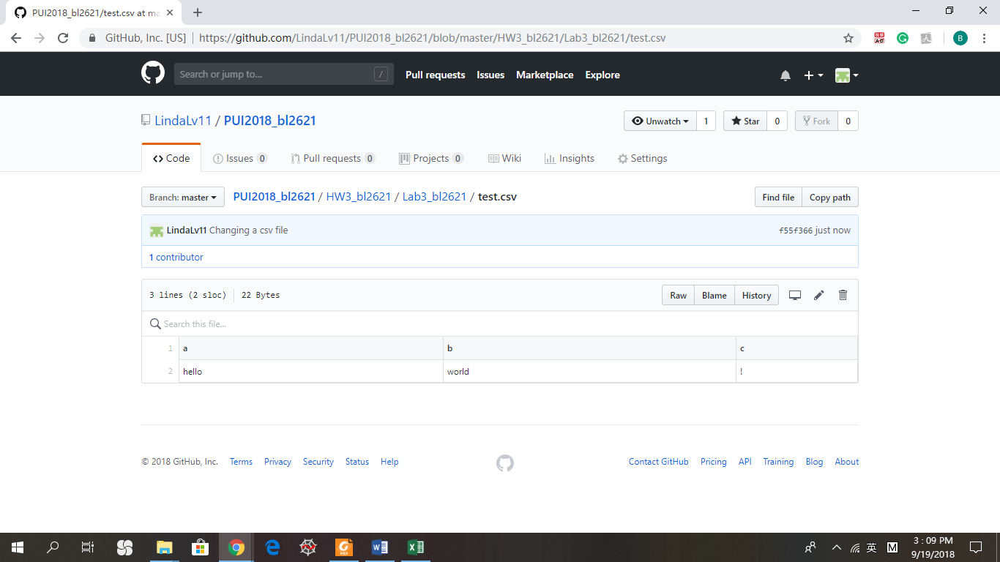
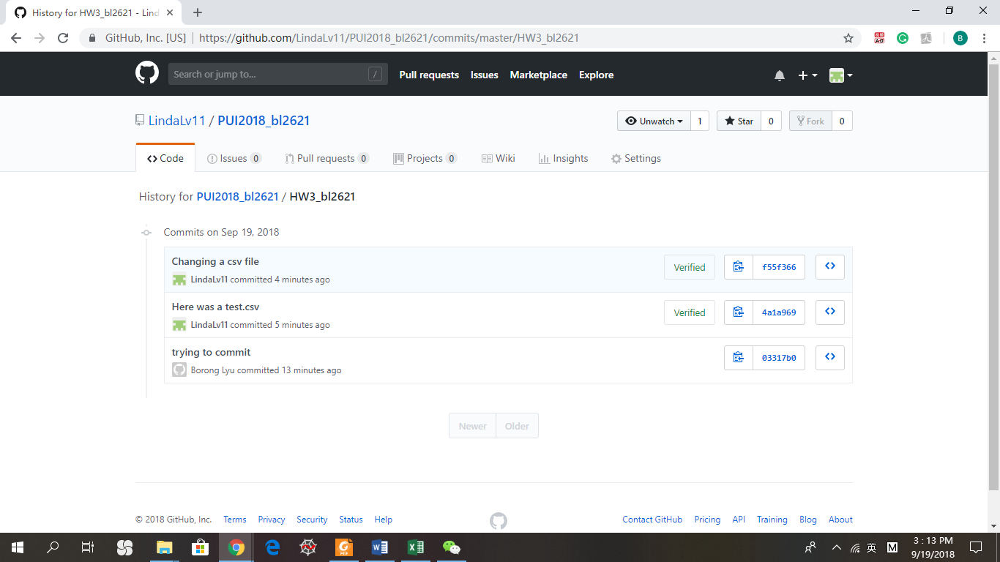
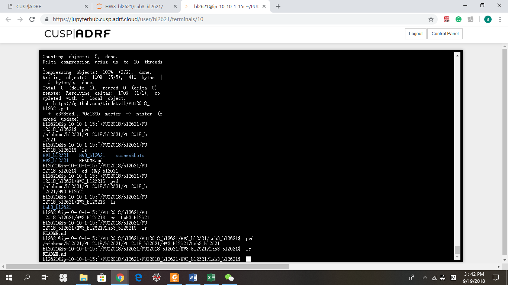
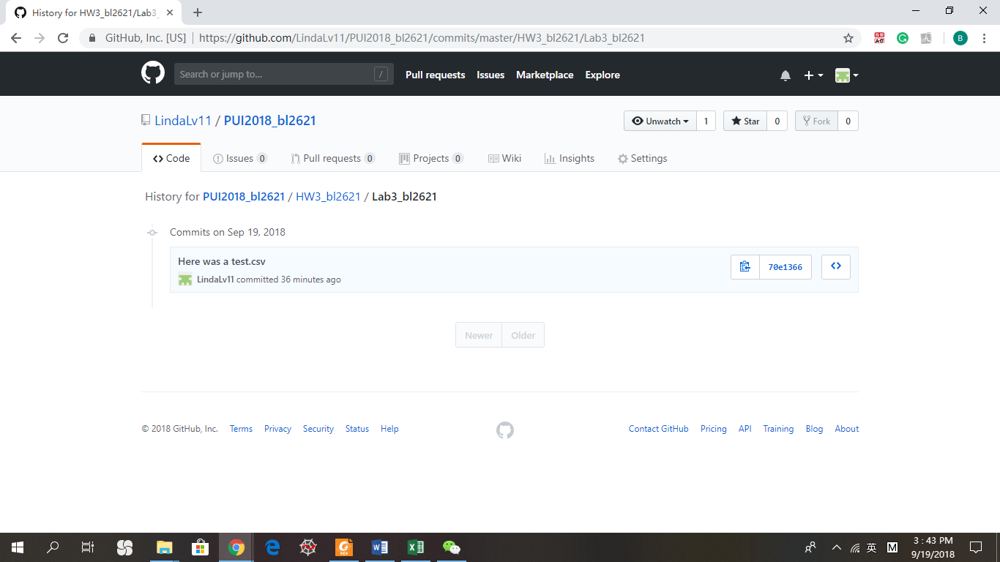

# The Scope of my homework:
## Assignment 1:
Created a 'test.csv' file in directory: HW3_bl2621/Lab3_bl2621. Deleted this file and its history from a Github repo

File removed from local:

## Assignment 2:
Chose E-Designations:CSV file (The first file I can see when I search CSV in the search bar) from NYC OpenData. 
Used Pandas to read the file and got a scatter plot of TAXLOT against TAXBLOCK
(Each plot is rendered with readable axes, title, legend, and caption)
## Extra Credit:
downloaded the Json file(This json file does not have headers so I added headers). Changed the format of the time and got two scatter plots:"Scatter plot of TAXLOT against Date" "Scatter plot of TAXBLOCK against Date"
## Assignment 3:
A python script that downloads file from MTA bus time using API. Inputs BUS_Line and outputs the bus name,
the number of vehicles, and their current position
## Assignment 4:
A python script that downloads file from MTA bus time using API. Inputs BUS_Line and creats a csv file.
Worked alone.
