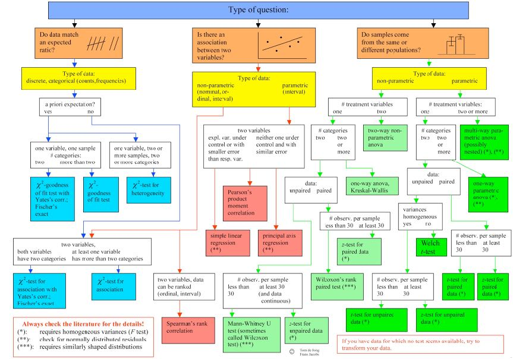

## bl2621 Citi Bike Hypothesis Testing

### Comments

1. The Null Hypothesis should state the mean trip duration of women is **greater than or equal to** the mean trip duration for men. The Alternative Hypothesis should be trying to disprove that statement. You had it backwards.

    $H_0$ : ${\mu_{\mathrm{{[W\:tripduration]}}}} \geq {\mu_{\mathrm{[M\:tripduration]}}}$

    $H_a$ :${\mu_{\mathrm{{[W\:tripduration]}}}} < {\mu_{\mathrm{[M\:tripduration]}}}$
    
    

2. The first plot is actually plotting the *amount of trips per male or female*, not the trip durration. You could revise by passing 'df.groupby([df['gender']]).mean()' instead in the first line. Consequently, you'll notice that the trip duration is actually longer for females (713 seconds) vs. men (627 seconds)

3. From your last two charts, it's pretty clear that there are some outliers in your dataset (from exponential growth of trip duration in at the end). I suggest getting rid of those since they could be from errors in the dataset (e.g. lost bikes, malfunction in bike dock, etc)

#### Appropriate Statistical Test: Z test for Unpaired Data

* The two sets of data (men and women) come from the same population 
* There is only one treatment variable (tripduration) and two categories (men vs. women)
* The data is unpaired (because it involves separate individuals for each group)
* The sample size is 100 (i.e. more than 30)

