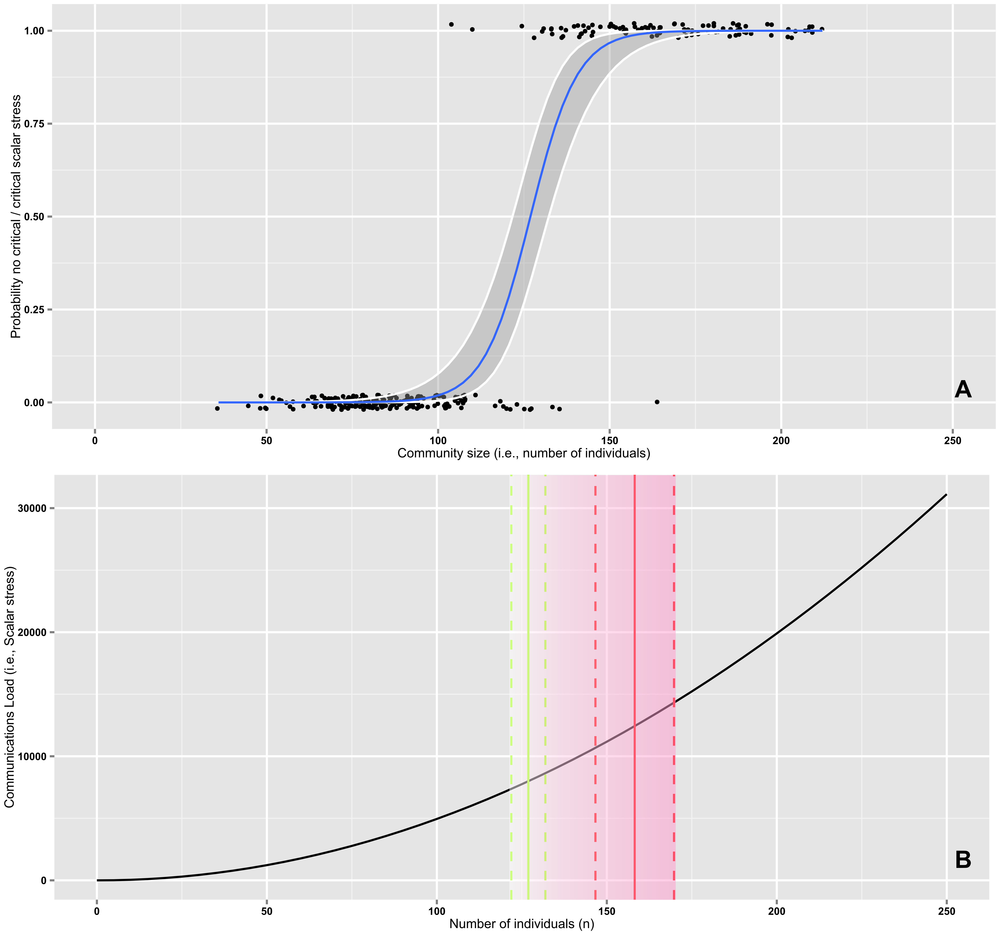

Work with rufy and tanya.

| **Statistical Analyses**	|  **IV(s)**  |  **IV type(s)** |  **DV(s)**  |  **DV type(s)**  |  **Control Var** | **Control Var type**  | **Question to be answered** | **_H0_** | **alpha** | **link to paper**| 
|:----------:|:----------|:------------|:-------------|:-------------|:------------|:------------- |:------------------|:----:|:-------:|:-------|
Logistic regression	| 1, population size(community size) | numeric(integer in this paper, since the independent variable is the number of individuals here ) | 1, experiencing not critical/critical scalar stress| dichotomous | 1, None | None |The relationship between the possibilities of experiencing a critical level of scalar stress and population sizes.| There is no relationship between 'experiencing critical scalar stress' and 'population size'| 0.05 |https://journals.plos.org/plosone/article?id=10.1371/journal.pone.0091510#pone-0091510-g005|
  |||||||||
  
  

