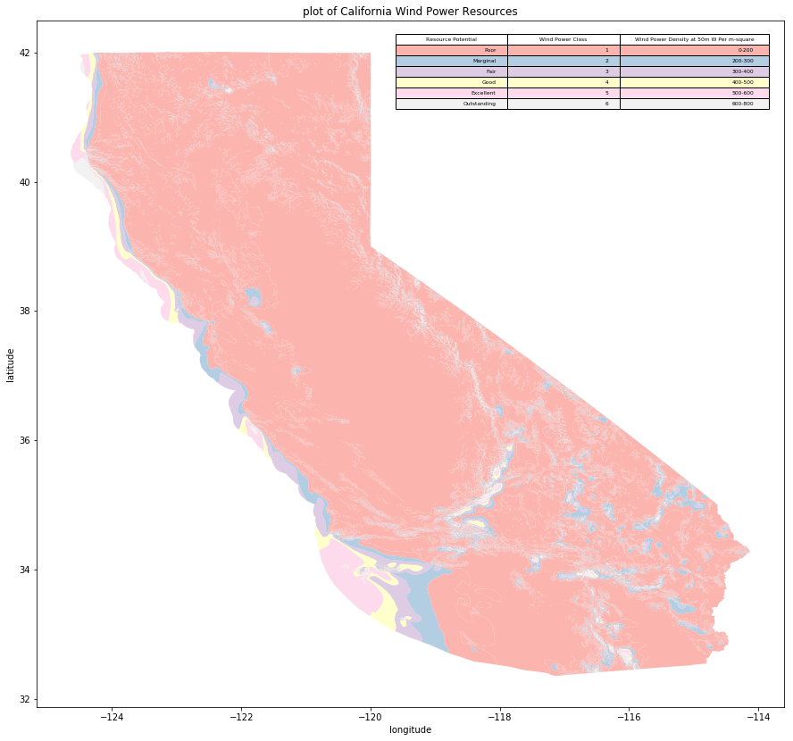

## Assignment 1:

Created a plot of Wind resouce available in California, United States.

50-meter hub height wind resouces in California.

Areas designated class 3 or greater are suitable for most utility-scale wind turbine applications, whereas class 2 areas are marginal for utility-scale applications but may be suitable for rural applications. Class 1 areas are generally not suitable.

Geographic Coordinate System Name: GCS_WGS_1984

These datasets are geographic shapefiles generated from original raster data. The data provide an estimate of annual average wind resource for states and regions. The data are separated into two groups: NREL-produced and AWS Truepower-produced/NREL-validated.

The Truepower-produced resource estimates factor in surface roughness in their calculations and do not exclude areas with slopes greater than 20%. These data were produced in cooperation with the U.S. Department of Energy WINDExchange program and have been validated by NREL and other wind energy meteorological consultants.

## Assignment 2:

https://www.authorea.com/335328/A2ZfQtD1yUQ4Vk9W6EvpBw

According to cb4184's review, I had my hypotheses backward.I think He/She is right about that. Great thanks to cb4184. In order to simplify my following hypothesis testing. I changed my null hypothesis into :
${\mu_{\mathrm{{[W\:tripduration]}}}} = {\mu_{\mathrm{[M\:tripduration]}}}$
  The average trip duration of men is equal to that of women.
And my alternative hypothesis is now:
${\mu_{\mathrm{{[W\:tripduration]}}}} \neq {\mu_{\mathrm{[M\:tripduration]}}}$
The average trip duration of men is different from that of women.
use a significance level  α=0.05.

However, I think since we don't know anything about the whole population. An unpaired 2 sample T-test is the appropriate test here. 

Not Z-test. 

Before applying T-test. I used Fisher's F test to test the hypothesis of equality of the variances. Then the result shows that these two samples have unequal sample sizes and unequal variances. 

As a result, the t statistics is smaller than the critical value. Thus, we reject the null hypothesis. The trip duration of the female is significantly different from the trip duration of the male.

